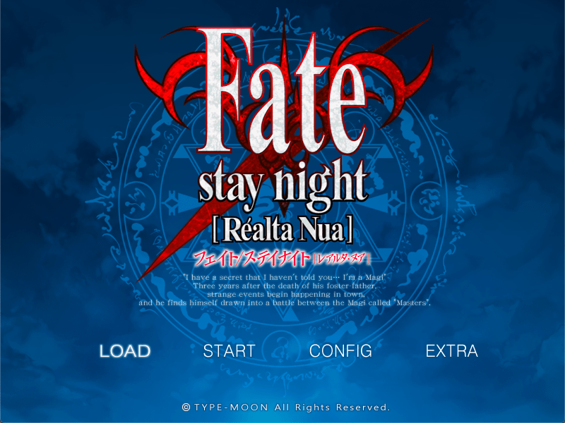

This page contains information related to Fate/stay night [Realta Nua] Ultimate Edition Vita Port.  

<hr />
<font color="#f00" size="6">If you have any issues, please make a <b>post on the following forum thread</b> for the fastest response times: </font>

<https://hollow-moon.github.io/fate/support/>
<hr />

<font color="#f00" size="4">This port supports <b>Japanese</b> and <b>English</b>.</font>  

If you get redirected to this page when running the Vita version, you have made an incorrect installation. In that case, please read the installation steps below (especially step 4).  

### Screenshots

{: .center-image }

### Installation

1. Prepare the install on a PC using the installer from the first page, or a [pre-patched version](https://forums.nrvnqsr.com/showthread.php/8229?p=3066122&viewfull=1#post3066122).
2. Replace the .xp3 files with the ones in [this link](https://forums.nrvnqsr.com/showthread.php/8229?p=3107585&viewfull=1#post3107585) inside the "Patches" folder.
3. Ensure the game works on PC by running "Fate.exe". If that doesn't work, it won't work on Vita either.
4. Copy the game files to "ux0:/fsnrnue/" **using the "USB" mode of VitaShell** so it looks like the following directory tree (do not add any additional files):
> ```
> ux0:
> └── fsnrnue
>   ├── bgimage.xp3
>   ├── bgm.xp3
>   ├── data.xp3
>   ├── etc.xp3
>   ├── fgimage.xp3
>   ├── image.xp3
>   ├── patch.xp3
>   ├── patch_h.xp3
>   ├── patch_lang_english.xp3
>   ├── patch_op.xp3
>   ├── patch_vita_ost.xp3
>   ├── rule.xp3
>   ├── sound.xp3
>   ├── video.xp3
>   └── voice.xp3
> ```
5. [Download the PlayStation Vita port](#download) of this project (which has the filename "fsnrnue.vpk"), then transfer and install the .vpk file using VitaShell.
6. On the LiveArea menu, click the installed bubble then click on the blue "Click here to run" text

### Usage tips

#### How to save

To save, you can go into the menu by pressing the Circle then pressing "Save".

#### How to transfer save from PC

Set Quality to "Low" and aspect ratio to 4:3.  
Transfer the folder "faterealtanua_savedata" to the "fsnrnue" folder using the "USB" mode of VitaShell so it looks like this:  
> ```
> ux0:
> └── fsnrnue
>   └── faterealtanua_savedata
> ```

### Known Issues

* Sleep mode will cause error (unless using FdFix)  
* Loading times will take a while (around 1m15s for initial start and 40s for scenario load)  
* Selecting 16:9 mode will cause error  
* Performance is slow (PSVshellPlus can be used to overclock and increase performance)

### Download

The following binaries are available here:  
* [Playstation Vita](https://github.com/Alyinghood/fsnrnue-multiplatform/releases/latest/download/fsnrnue.vpk)  

### Changelog
#### 1.0.1
* Major stability improvements.

#### 1.0.0
* Initial, broken release.

### Subpages
* [Support forum thread](https://hollow-moon.github.io/fate/support/)  
